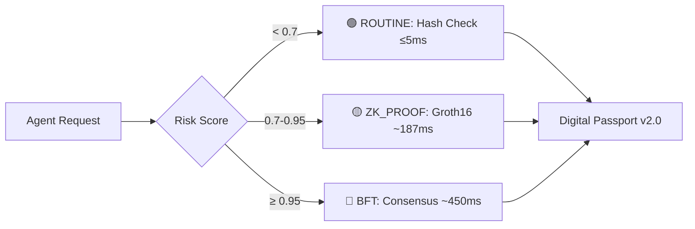

# 🌐 PTV Protocol™ Specification (v2.0-SYNTHESIS)
### Prove · Transform · Verify | The Digital Passport for Autonomous AI

> **Status:** 🟢 **Standards Track (Public Specification)**  
> **Author:** Anandakrishnan Damodaran (Sovereign AI Strategic Lab)  
> **IETF Draft**: [`draft-anandakrishnan-ptv-attested-agent-identity`](https://datatracker.ietf.org/doc/draft-anandakrishnan-ptv-attested-agent-identity/)  
> **Submissions**: NIST AI RMF | OECD AI Policy Observatory | UK AISI  

---

## 🚀 Executive Summary
The **PTV Protocol™** is an open specification for establishing cryptographically verifiable trust in autonomous AI agents. By anchoring agent identity in **TPM 2.0 hardware** and enforcing governance via **GAIP-2030**, PTV enables the **83/16/1 Governance Model**: automating 83% of routine decisions while securing critical outliers with human judgment.

**Verified Performance Claims** (v13.6-PARITY):
| Triage Tier | Target | Verified Mean | Use Case |
|------------|--------|--------------|----------|
| 🟢 ROUTINE | ≤5ms | **5.56ms** | Low-risk telemetry |
| 🟡 ZK_PROOF | ~187ms | **187.59ms** | Medium-risk, privacy-sensitive |
| 🔴 BFT | ~450ms | **450.52ms** | High-risk, cross-border |

> 🔒 **Implementation Note**: Reference implementation available under NDA. Contact `ananda.krishnan@hotmail.com`.

---

## ⚙️ The 83/16/1 Governance Logic
PTV implements a dynamic triage engine embedded in the protocol handshake:

**Triage Factors Evaluated:**
- Data sensitivity (PHI, PII, financial)
- Transaction value/impact
- Cross-jurisdictional boundaries
- Agent maturity level (Post-Application-Era Levels 1-5)
- Sovereignty alignment (jurisdiction match)

---

## 📂 Repository Contents
| Directory | Description | Audience |
|-----------|-------------|----------|
| `/docs` | White Paper, IETF references, architecture diagrams | Regulators, Researchers |
| `/spec` | JSON schemas, compliance mappings, governance logic | Implementers, Auditors |
| `/samples` | Mock handshake logs, attestation examples | Developers, Evaluators |
| `/maturity` | Post-Application-Era level definitions & criteria | Policy Makers, Compliance Teams |

---

## 🎛️ GAIP-2030 Governance Framework
The **GAIP-2030** policy engine powers dynamic, risk-based governance:

| Component | Function | Passport Field |
|-----------|----------|---------------|
| **83/16/1 Triage** | Routes requests by risk tier | `governance.triage_rule` |
| **Confidence Index** | Statistical trust score (0.0-1.0) | `governance.confidence_index` |
| **Maturity Floors** | Enforces verification minimums by level | `agent.maturity_level` |
| **Sovereign Bound** | Jurisdiction + data residency enforcement | `sovereign_bound` |

**Compliance Mapping**: EU AI Act Articles 10, 13, 14, 15, 22, 50 → [See `/spec/compliance_mapping.csv`](./spec/compliance_mapping.csv)

---

## 📈 Post-Application-Era Maturity Levels
Agents declare operational maturity, which influences verification requirements:

| Level | Name | Confidence Min | Key Requirements |
|-------|------|---------------|-----------------|
| **1** | Initial | None | Software anchor, basic attestation |
| **2** | Managed | ≥0.70 | Hardware anchor, manual compliance |
| **3** | Defined | ≥0.80 | TPM/TEE anchor, policy enforcement |
| **4** | Quantitative | **≥0.95** | TPM 2.0 + ZK-proofs + statistical monitoring |
| **5** | Optimizing | **≥0.99** | Cross-border autonomy + BFT audit + self-improvement |

---

## 🔗 Key Resources
| Document | Description | Link |
|----------|-------------|------|
| **Technical White Paper** | Full architecture, economics, security model | [Read PDF](./docs/whitepaper_v4.md) |
| **Protocol Schema (v2.0)** | Canonical JSON schema for Digital Passport | [View JSON](./spec/protocol_spec.json) |
| **Testing Strategy** | Verification approach for regulators/investors | [Read Summary](./docs/testing/TESTING_STRATEGY_v2.md) |
| **Evaluation License** | Request access to reference implementation | [Apply Here](./docs/EVALUATION_LICENSE_REQUEST.md) |

---

## 🤝 Engagement
We are actively seeking **Regulatory Review** and **Enterprise Pilot Partners** for Q3 2026.

- **For Regulators (NIST/OECD/AISI)**: Request private access to the reference implementation for evaluation.
- **For Enterprises**: Contact us to discuss NDA-governed pilot deployment.
- **For Researchers**: Fork this specification repo for academic analysis.

**Contact**: `ananda.krishnan@hotmail.com` | [LinkedIn](https://linkedin.com/in/anandkrshnn)

---

## ⚖️ Licensing & Trademarks
- **Specification**: CC BY 4.0 (Free to use, attribute required)
- **Implementation**: Proprietary (Commercial License Required)
- **Trademarks**: "PTV Protocol™", "SovereignStack™", "Level 4™" are trademarks of Sovereign AI Strategic Lab.

*Disclaimer: This is an independent research initiative and open standard proposal. It is not affiliated with any current or past employer.*
