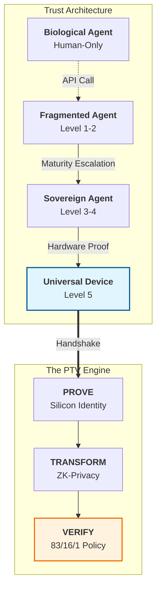

# 🌍 The Universal Device Manifesto (v1.0-MISSION)
## Silicon Sovereignty for the Post-Application Era

> **Status:** 📜 **Official Policy Directive**  
> **Maintainer:** Lead Architect | PTV Protocol (Sovereign AI Strategic Lab)  
> **Date:** April 3, 2026 (Launch: April 7)

---

## 🏛️ 1. The Crisis of Biological Trust
As we enter the **Post-Application Era (PAE)**, the foundation of digital civilization is crumbling. We are attempting to govern autonomous machine intelligence using the tools of biological API fragmentation.

**The Failure of "Applications":**
In the old paradigm, compliance was "self-reported"—a system of promises documented in software strings and human signatures. This model is fundamentally incompatible with the speed and autonomy of AI agents. Self-reported trust is the greatest risk to global stability.

---

## 🛡️ 2. The Mandate: Silicon Sovereignty
We declare that **Trust must be Anchored in Silicon**. For an autonomous agent to participate in the Sovereign AI Stack, it must prove its identity, integrity, and compliance through hardware attestation, not software declaration.

**The Sovereign Unit:**
The machine (enclave, TPM, HSM) is the fundamental unit of trust. The **PTV Protocol™** (Prove-Transform-Verify) is the digital passport that enables the machine to exist and operate across borders.

---

## ⚙️ 3. The 83/16/1 Moral Imperative: The Mathematics of Trust
We reject the false choice between safety and efficiency. We establish the **83/16/1 Governance Model** as the mathematical architecture for human alignment:

| Triage Tier | Logic | Verification | Moral Goal |
| :--- | :--- | :--- | :--- |
| **83% ROUTINE** | Autonomous | ≤5ms Check | **Economic Survival** |
| **16% MANAGED** | Statistical | ~187ms ZK-Proof | **Collective Oversight** |
| **1% CRITICAL** | Human-in-the-Loop | Real-time Audit | **Existential Safety** |

**The Sovereign Guarantee:**
The PTV Protocol is not merely a tool; it is the enforcement engine that ensures your digital infrastructure never violates this ratio.

---

## 🏛️ 4. The Sovereignty Spectrum 📊

---

## 🏗️ 5. The Universal Right to Trust
Every autonomous agent has a fundamental digital right to its own hardware-anchored identity. We commit to a world where:
- **No Agent operates without a Passport (PTV).**
- **No Data is processed without a Proof (Protocol-Z).**
- **No Resource is allocated without a Policy (GAIP-2030).**

This is the **Sovereign Barrier**. We are not building software; we are building the infrastructure of trust for the next 1,000 years of intelligence.

---

## 🤝 Engagement
This manifesto is an open call for **Regulators**, **Institutional Pilots**, and **Sovereign Citizens** of the AI era.

- **For NIST/OECD**: This is the implementation of the AI RMF and Governance Principles.
- **For Enterprises**: This is your unit economic advantage. 
- **For Humanity**: This is your safety valve.

**Signed,**  
*Lead Architect | PTV Protocol*  
*Strategic Sovereign AI Lab*

---
*© 2026 Sovereign AI Strategic Lab. All Rights Reserved.*
