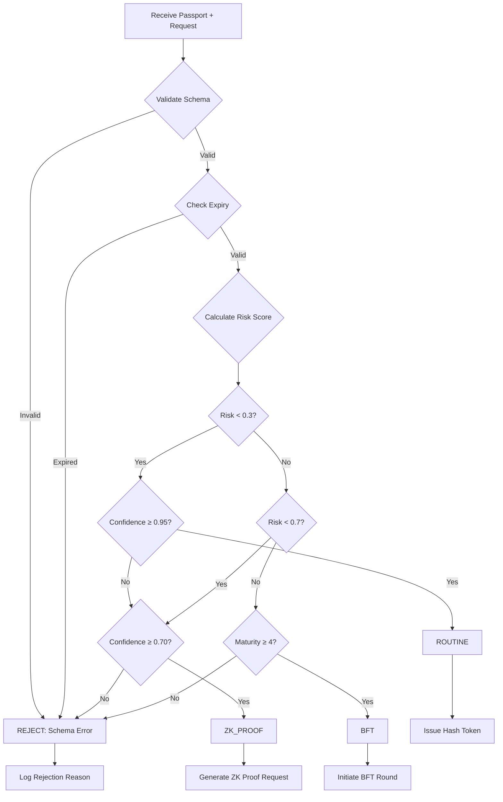

# GAIP-2030 Governance Logic Reference
## Technical Specification for Policy-Driven Verification Routing

**Version:** 1.2  
**Status:** Active  
**Last Updated:** April 2026

---

## 1. Overview

The **GAIP-2030** (Governance-Aware Intelligent Policy) engine is the decision-making core of the PTV Protocol. It dynamically routes verification requests to the appropriate tier (ROUTINE, ZK_PROOF, or BFT) based on:

1. **Risk assessment** of the request
2. **Agent maturity level** and confidence index
3. **Jurisdictional requirements** (data residency, compliance frameworks)

---

## 2. The 83/16/1 Triage Algorithm

### 2.1 Mathematical Foundation

The triage decision is a multi-variate function:

```
triage(P, R) → {ROUTINE, ZK_PROOF, BFT, REJECT}

Where:
  P = Passport (agent identity and metadata)
  R = Request (operation being requested)
```

### 2.2 Decision Tree



### 2.3 Risk Scoring Formula

```python
def calculate_risk_score(request):
    """
    Compute composite risk score from multiple factors.
    
    Returns: float in range [0.0, 1.0]
        0.40 * data_sensitivity +
        0.30 * transaction_value +
        0.20 * jurisdiction_crossing +
        0.10 * agent_history
    """
    return risk_score
```

---

## 4. Maturity Floor Enforcement

### 4.1 Maturity Level Requirements by Tier

| Tier | Min Level | Rationale |
|------|-----------|-----------|
| **ROUTINE** | 3 | Defined process (TPM anchor) |
| **ZK_PROOF** | 3 | Cryptographic capability required |
| **BFT** | 4 | Quantitative management + adversarial resilience |

---

*© 2026 Sovereign AI Strategic Lab*  
*Reference implementation available under NDA*
